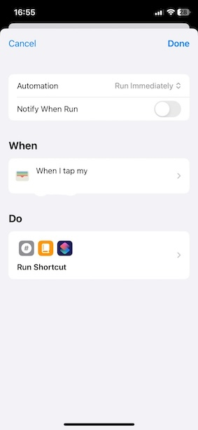
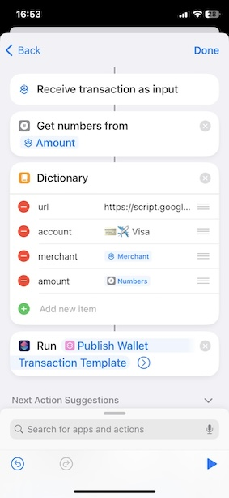

# Publish Apple Wallet Transactions To Actual Budget

This post contains one way to automatically send transactions made with Apple Wallet (iOS >= 17) to [Actual Budget](https://actualbudget.org).

## Pre requisites

1. Have an [Actual Budget](https://actualbudget.org/docs/install/docker) instance running
1. Deploy [Actual Budget HTTP Api](https://github.com/jhonderson/actual-http-api/tree/main)
1. Having a Google account

## Steps

Since the transaction needs to be posted to some server, this approach will make use of intermediary Google AppScript Web Application.

### Create the Google AppScript Web App

1. Create a new [Google Spreadshit](https://docs.google.com/spreadsheets/) or open an existing one
1. In the tool bar, click Extensions > Apps Script, that will open a new App Script project
1. Name it however you want, and copy/paste the code from [Code.js](./Code.js) into the AppScript project.
1. Change the configuration values using yours (account names, categories, actual api configuration parameters, account ids, category ids)
1. Deploy the project as a Web application
   1. Click Save Project (save icon)
   1. Click Deploy (on the top right)
   1. Choose New deployment
   1. Select type: Web app
   1. Name it however you want, i.e Actual Proxy
   1. In "Who has access" choose Anyone, so that the api is public
   1. Click Deploy
   1. Click Authorize Access
   1. Choose your google account
   1. Click the link "Advanced"
   1. Click the link "Go to Untitled project (unsafe)"
   1. Click Allow
   1. Copy the web app url, you will need it when configuration the Shortcuts Automation

### Clone the Apple Shortcut and Create Automation

Clone the shortcut I created by opening the following link: https://www.icloud.com/shortcuts/3d7b4213218e4e9a9ee517f89f2c9791, and clicking "Add Shortcut".

Now create an Apple Wallet automation by opening the Shortcuts app, going to the Automation section (at the bottom) and creating a new automation. You will need to do this for each account you have in your Apple wallet (i.e if you have 2 credit cards, you'd have to create 2 automations):
1. Click "+" (top right)
1. Choose "Transaction"
1. In "When I tap", choose the account you want to configure (choose only one. To configure more you'll need to create another automation)
1. Choose Run Immediately (bottom)
1. Tap "Next"
1. Choose "New Blank Automation"
1. Click "Add Action"
1. Add a "Get numbers from Input", and choose "Shortcut Input", tap "Shortcut Input" again, choose type "Transaction" and field "Amount".
1. Add a "Dictionary" and add 3 new items:
   1. type: Text, name: url, value: the Google App Script you copied from the previous section
   1. type: Text, name: account, value: Your account name, i.e 💲Checking
   1. type: Text, name: merchant, value: choose "Shortcut Input", tap "Shortcut Input" again, choose type "Transaction", and field "Merchant".
   1. type: Number, name: amount, value: choose "Numbers" (generated from previous action)
1. Add "Run Shortcut", and select the Shortcut you added (cloned) called "Publish Wallet Transaction Template"
1. Try to run the shortcut with the play icon at the bottom-right. It will fail but it will let you grant permissions to the shortcut.

The Automation should look like:

When you click the Do section, it should look like (except the account value):

**Why one automation per account?**: As of Dec/2023, Apple doesn't provide a parameter for the account name whenever the automation triggers, therefore there is no way to know where is the transaction coming from.

## Issues/Limitations

1. I found that my phone has to be unlocked when I use Apple wallet for the shortcut to run as expected. Otherwise it will be executed but with empty values. This may get fixed in the future
1. Having a google appscript project in between can be too much for some people. But there needs to be a place where the conversion between account names to account ids and category names to category ids happen, since Actual api (and Actual budget) don't accept names as input, but rather ids. This can be simplified by using the account id directly in the shortcut, not sending the category at all (it can be entered in Actual budget manually later on), and calling the Actual Api directly from the shortcut using a http POST call

